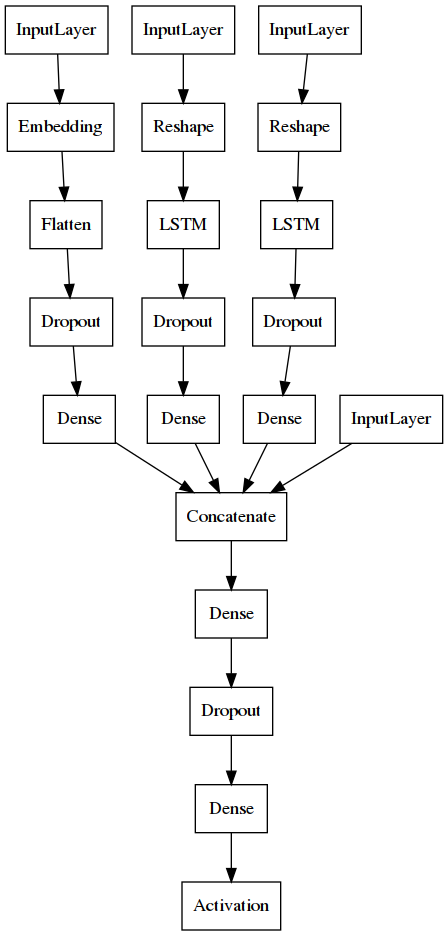

# Policy Network for MCTS Menu

This document explains the model design of the policy network, how to train it, and how to use it to make predictions.

**Note:** It is highly recommended to use a Python environment, to ensure that we use the right software dependencies and their versions.
I used pipenv, so there should be a `Pipfile` in each directory with runnable code.
You can also use Conda, virtualenv, or any other Python environment.

The goal of the policy network is to predict which menu states are worth of expansion in MCTS.
According to my own benchmarks, the trained model can provide around 1000 predictions per second when running on a GPU.

## Model Design

The policy network is implemented as an artificial neural network with three heads and one tail.

**Input:** The model receives a batch of adaptation instances, defined as (1) the source menu configuration, (2) the click distributions w.r.t. such menu configuration, and (3) the association matrix between menu elements. *Currently a menu instance can have up to 20 menu items, including separators. We can increase the model capacity if needed.*

Notice that the *user input* does not follow this format. Instead, the user has to provide the current menu configuration (elements, click distribution, and association matrix) plus the exposed flag, and the `ValueNetwork` class will automatically format the required input to the model. See [Use](#use) section below.



The source menu is modeled as an Embedding layer, whereas the click distributions and association matrix are both modeled by LSTM layers. Dropout layers are added before each head input for regularization, aimed at making the model more generalizable.

**Output:** The model outputs a dictionary where keys are `(i,j,op,exp)` tuples,
where `i` and `j` are menu element indices, `op` is the operation type performed over the two menu elements `i` and `j`, 
and `exp` is a binary flag that indicates whether the menu was shown to the user.

## Train

First generate some training data with the "pump" program.
It will create a `results.txt` file with all the menu adaptation instances.
Each line in that file must follow the following format:
`[source_menu][source_frequencies][source_associations][exposed]}{dict}`.

I edited `pump_policy_network.py` and set the following pump controls:
```python
number_of_unique_menus = 50
number_of_adaptations = 50
timeBudget = 1000
maxdepth = 10
```
Then I ran this in the terminal:
```sh
[pipenv run] python3 pump_policy_network.py
```
which generated a `results.txt` file with 1623 menu instances.

Then I trained the model by running this:
```sh
[pipenv run] python3 train.py /path/to/results.txt
```

After training, you will see a h5 file. This is the model you have to use for predicting all possible adaptations of a given menu instance.

**Note:** If you use pipenv, the current `Pipfile` specifies `tensorflow ~= 2.0` but if you have a GPU then install `tensorflow-gpu ~= 2.0` instead to speed up training.

## Use

This is the minimal working example to use the model for inference:
```python
from model import PolicyNetwork

pn = PolicyNetwork('model.h5')

# Then, at some point in MCTS, predict some samples.
adaptations = pn.predict_batch(samples)
```
where `model.h5` is the trained model file and `samples` is a collection of adaptation instances.

An adaptation instance is a list with 4 items:

- `source_menu` (list): Source menu configuration.
- `source_frequencies` (list): Click frequency over source menu items.
- `source_associations` (list): Association matrix between source menu items.
- `exposed_flag` (bool): Whether the menu was shown to the user.

**Note:** In this example, `adaptations` is a dictionary 
where keys are state tuples (e.g. `(0,1,2,1)`) and values are the estimated reward for each state.

